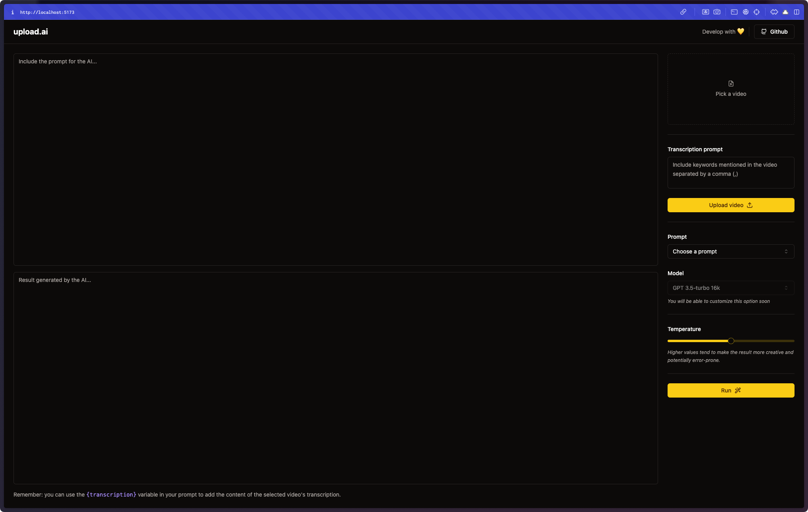
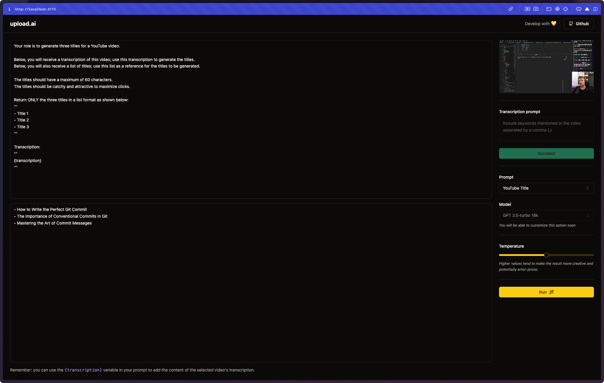
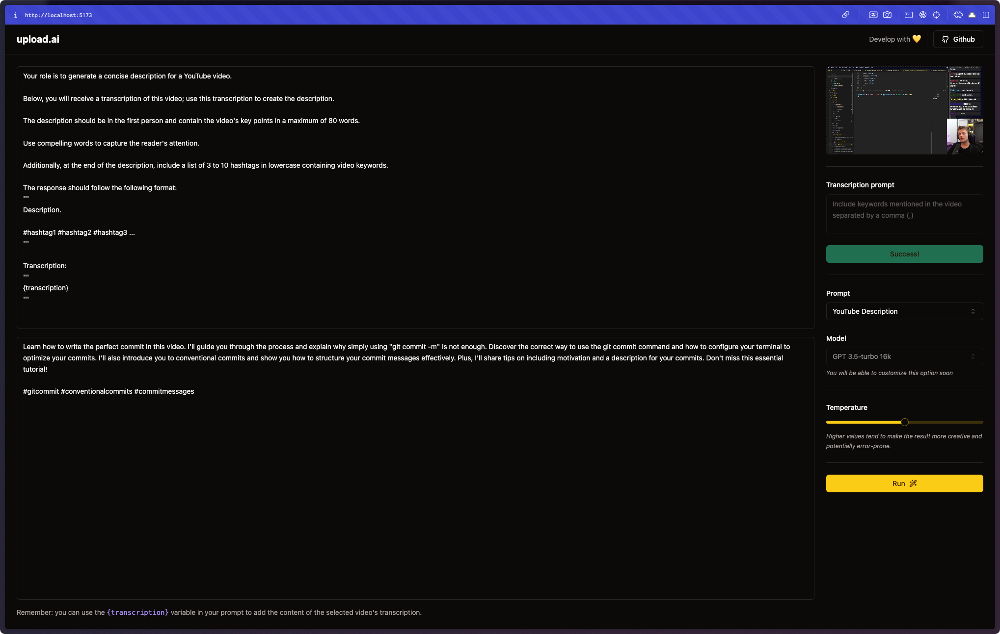

### upload-ai


## 🎯 Overview

In this project, I've structured the application into two distinct layers: the API layer, designed for video processing and integration with OpenAI, and the web layer, which facilitates user interaction and preference customization. 

The goal is to generate video transcripts and use this material in AI prompts to create content based on templates. Through the app experience demonstrated below, you can see it being used to generate video descriptions or even titles. 

The prompts are fully editable, allowing for customization to meet a wide array of needs.

## 🌟 App Experience





## ▶️ Getting started

**Clone the repository**
```bash
$ git clone https://github.com/wladimirgrf/upload-ai.git && cd upload-ai
```

**Install the Project dependencies**
```bash
$ npm --prefix ./api install
$ npm --prefix ./web install
```

**API configuration**
```bash
# Make a copy of '.env.sample'
# Fill both files with YOUR environment variables.
$ cp api/.env.sample api/.env

# Run the migrations
$ npm run --prefix api db:migrate
```

**Launch the API**
```bash
$ npm run --prefix api dev
```

**Launch the Application**
```bash
$ npm run --prefix web dev
```

>The API will be launch on `http://localhost:3333`<br>
>The web APP will be available on `http://localhost:5173`


## 🤝 Contributing

**Fork the repository and clone your fork**

```bash
$ git clone fork-url && cd upload-ai
```

**Create a branch for your edits**
```bash
$ git checkout -b new-feature
```

**Make the commit with your changes**
```bash
$ git commit -m 'feat: New feature'
```

**Send the code to your remote branch**
```bash
$ git push origin new-feature
```

Create a pull request with your version. <br>
After your pull request is merged, you can delete your branch.


## 📝 License

This project is licensed under the MIT License - see the [LICENSE](LICENSE) file for details.
